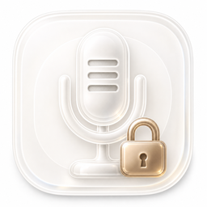
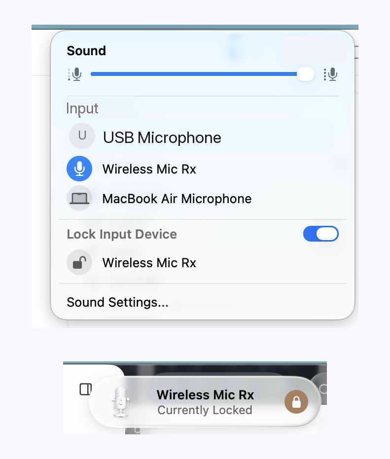
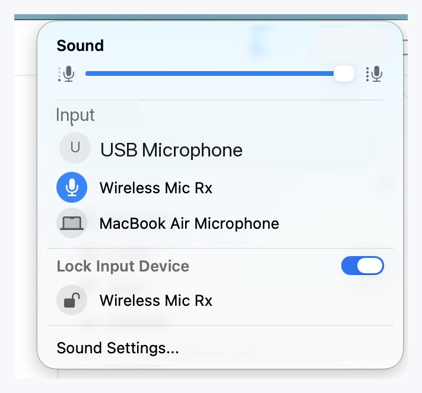
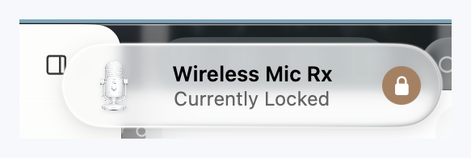

# AudioInputLocker

<p align="center">
  
</p>

<p align="center">
  <a href="https://github.com/tungloong/AudioInputLocker/actions/workflows/build.yml"></a>
  <a href="https://github.com/tungloong/AudioInputLocker/releases"></a>
  <a href="LICENSE"></a>
</p>

[English](README.md) | [简体中文](README_CN.md)

AudioInputLocker is a small macOS menu bar app for managing and locking the
system default audio input device.

macOS has a native-looking Sound menu for output devices, but not a matching
menu for microphones and other input devices. AudioInputLocker fills that gap
with a Sound-style input menu, plus a lock mode that keeps your preferred input
device selected when macOS or another app tries to switch it away.

<p align="center">
  
</p>

## Status

AudioInputLocker is early open-source software. The source is available under
the MIT License, and preview builds are available from GitHub Releases.

Mac App Store and notarized direct distribution are being prepared. The main
technical validation still needed for the App Store path is confirming that App
Sandbox does not block the Core Audio device-switching behavior on real Macs.

## Download

- [0.1.0 Preview Release](https://github.com/tungloong/AudioInputLocker/releases/tag/v0.1.0-preview)
- [All GitHub Releases](https://github.com/tungloong/AudioInputLocker/releases)
- Current preview builds are not notarized. macOS may show a Gatekeeper warning.
- For the most transparent path, build and run from source.

## Screenshots

| Menu popover | Restore HUD |
| --- | --- |
|  |  |

## Features

- Menu bar extra with a native macOS Sound-style popover.
- Lists Core Audio input devices.
- Switches the system default input device from the menu.
- Shows and controls input volume when the device exposes a writable volume.
- Locks a preferred input device and restores it after external changes.
- Preserves the locked device across app restarts with `UserDefaults`.
- Keeps locked offline devices visible so reconnecting a USB mic or headset does
  not lose the user's intent.
- Shows a transient HUD when the app restores the locked input device.
- Supports English and Simplified Chinese, following the system language.

## Requirements

- macOS 13.0 or later at runtime.
- Xcode with the macOS 26 SDK to build the current source.

The app targets macOS 13.0. The HUD uses public macOS 26 Liquid Glass APIs when
available and falls back on older systems.

## Build And Run

Clone the repository:

```sh
git clone https://github.com/tungloong/AudioInputLocker.git
cd AudioInputLocker
```

Then use the local helper script:

```sh
./scripts/build-and-run.sh
```

The script builds the Debug app, stops any running `AudioInputLocker` process, and
opens the freshly built app from `build/DerivedData`.

Manual build:

```sh
xcodebuild \
  -project AudioInputLocker.xcodeproj \
  -scheme AudioInputLocker \
  -configuration Debug \
  -destination 'platform=macOS,arch=arm64' \
  -derivedDataPath build/DerivedData \
  build
```

For a non-Apple-Silicon destination, override `DESTINATION` when running the
script.

## Usage

1. Launch the app.
2. Open the microphone icon in the menu bar.
3. Pick an input device to make it the system default.
4. Enable `Lock Input Device` and choose the device you want to keep active.

When lock mode is enabled, AudioInputLocker watches Core Audio device changes.
If another process, System Settings, AirPods auto-switching, or a command-line
tool changes the default input, the app switches back to the locked device when
that device is online.

## Localization

The app currently ships with:

- English: `AudioInputLocker/en.lproj/Localizable.strings`
- Simplified Chinese: `AudioInputLocker/zh-Hans.lproj/Localizable.strings`

Device names come from Core Audio and are shown as reported by macOS or the
device itself.

## Project Layout

- `AudioInputLocker/AudioInputLockerApp.swift`: app entry point and menu bar extra.
- `AudioInputLocker/SoundMenuView.swift`: Sound-style menu popover.
- `AudioInputLocker/AudioInputViewModel.swift`: app state, lock behavior, Core
  Audio orchestration, and HUD implementation.
- `AudioInputLocker/CoreAudioInputManager.swift`: Core Audio wrapper.
- `AudioInputLocker/InputDevice.swift`: input device model and icon heuristics.
- `AudioInputLocker/HUDMicrophone.png`: HUD microphone asset.
- `AudioInputLocker/Assets.xcassets`: app icon and menu bar icon assets.
- `scripts/build-and-run.sh`: local build and restart helper.
- `scripts/package-preview-release.sh`: local preview release packaging helper.
- `docs/visual-assets.md`: icon assets and visual notes.
- `docs/troubleshooting.md`: FAQ and troubleshooting notes.
- `docs/github-release.md`: GitHub repository setup notes.
- `docs/app-store`: App Store metadata, privacy policy, and release checklist.
- `docs/releases`: release notes used for GitHub Releases.
- `docs/liquid-glass-investigation.md`: historical notes from HUD visual
  experiments.
- `docs/project-notes.md`: early project context and implementation notes.
- `CHANGELOG.md`: notable project changes.
- `CONTRIBUTING.md`, `SUPPORT.md`, and `SECURITY.md`: community and
  maintenance guidance.

## Implementation Notes

AudioInputLocker is built with SwiftUI, AppKit, and Core Audio.

- The app is a menu bar utility and hides the Dock icon with `LSUIElement`.
- Core Audio is used for device enumeration, default input switching, input
  volume reads and writes, and device-change monitoring.
- The lock state is stored locally in `UserDefaults`.
- App Sandbox entitlements are included for Mac App Store validation.
- The HUD is an `NSPanel` at status-bar level so it can sit near the menu bar
  without taking normal app focus.
- The app does not use private APIs.

## Privacy

AudioInputLocker works locally on your Mac. It does not include analytics,
network calls, accounts, or telemetry.

The app stores only local preferences such as the locked input device identifier
and display name. The public privacy policy is available at
[tungloong.github.io/AudioInputLocker/privacy.html](https://tungloong.github.io/AudioInputLocker/privacy.html).

## FAQ

### Does AudioInputLocker record audio?

No. AudioInputLocker does not record, process, upload, or analyze microphone
audio. It only manages the selected system input device through Core Audio.

### Why does a device have no volume slider?

Some input devices do not expose a writable input-volume control through Core
Audio. The slider appears only when macOS reports that the device supports it.

### Does lock mode work with AirPods and USB microphones?

That is the main workflow. When the locked device is online and another process
changes the default input, AudioInputLocker switches back to the locked device.
Behavior can still vary by device firmware and macOS routing rules.

### Does the app need microphone permission?

The app does not record audio, so it is not expected to request microphone
recording permission.

More notes are in `docs/troubleshooting.md`.

## Roadmap

- Ship a signed and notarized direct-download build.
- Validate App Sandbox behavior for Mac App Store distribution.
- Add automated coverage for the lock state machine where practical.
- Add release packaging and upload automation beyond the preview script.

## Contributing

Issues and pull requests are welcome. Please keep changes focused and preserve
the native macOS feel of the menu and HUD. See `CONTRIBUTING.md`, `SUPPORT.md`,
and `SECURITY.md` for project guidance.

Useful checks before opening a pull request:

```sh
./scripts/build-and-run.sh
```

For changes that affect lock behavior, please also test at least one real device
switching scenario, such as AirPods auto-switching, System Settings changes, or
USB microphone reconnects.

## License

AudioInputLocker is released under the MIT License. See `LICENSE`.
