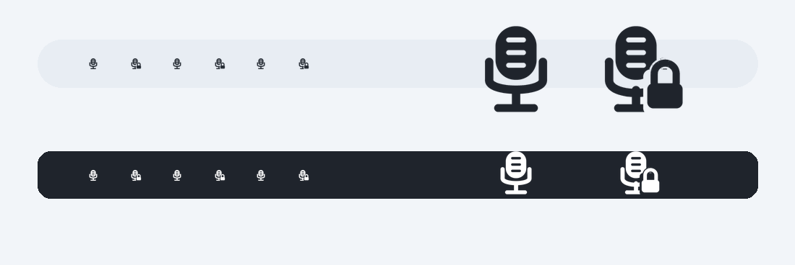

# Visual Assets / 视觉资源

这里记录 AudioInputLocker 目前用到的几项视觉资源：App 图标、菜单栏图标和后续截图素材的基本方向。它只是一个常驻菜单栏的小 app，所以视觉目标是安静、原生、清楚，不需要做成一套很重的设计手册。

## App Icon


图标概念是麦克风和锁的组合：麦克风代表系统输入设备，锁代表锁定并恢复偏好的默认输入。当前方向是白色玻璃底、白灰/珍珠色麦克风、暖古铜锁头，参考 macOS 26 Liquid Glass 系统图标的分层、霜化、透光边缘和克制高光，但刻意避免蓝色大底、强彩色渐变和旧式重拟物。App Icon 里的锁头允许和麦克风轻微重叠，并保留锁孔细节来增加可读性。

Files:

- `docs/assets/audio-input-locker-app-icon.png`: 1024px master for README, store copy, and future exports.
- `AudioInputLocker/Assets.xcassets/AppIcon.appiconset`: compiled macOS app icon sizes.

Generation prompt:

```text
Use case: macOS app icon
Asset type: macOS app icon, square 1024x1024
Primary request: Create a refined macOS 26 / Liquid Glass style app icon for AudioInputLocker, a small macOS menu bar utility that locks the selected microphone input device.
Design direction: Native Apple system-app quality, quiet and premium, closer to macOS Tahoe / Liquid Glass than older skeuomorphic macOS icons. Use layered translucent glass, frostiness, lensing-like edge highlights, subtle specular highlights, gentle depth, and generous breathing room. Avoid heavy bevels, old metallic chrome, dark glossy badges, busy realism, and dated 2010-era gradients.
Subject: A centered, upright, front-facing microphone as the main symbol, clearly recognizable and optically balanced. The microphone should be made from warm white, pearl, soft gray, and translucent frosted-glass/ceramic layers, with rounded bold forms and a few clean grille slots. Add a lower-right padlock badge that is clearly a lock, simple and elegant, in muted antique bronze / warm brass glass material. Place the lock slightly inward from the extreme corner, allow subtle overlap with the microphone base, and include a small refined keyhole detail. The App Icon does not need to follow the single-color menu bar glyph; it can use full color, subtle transparency, and richer material layering.
Composition: Direct clean white / off-white rounded-square macOS app icon background, with very subtle layered glass panels, soft inner shadows, soft highlights, and no blue base. Keep the palette mostly white, ivory, pearl gray, silver gray, and muted bronze, with at most tiny restrained prismatic highlights from the glass.
Readability: Strong at small sizes, frontal not angled, simple silhouette, no music notes, no UI screenshot, no waveform, no excessive details.
```

## Menu Bar Icon



菜单栏图标使用自定义 template image，而不是 SF Symbol。它有两种状态：普通状态只显示直立麦克风；锁定生效状态显示同一麦克风加右下角锁头。普通态的麦克风轴线对齐 18pt 画布中心；锁定态会切掉麦克风右下角，并在锁钩顶部额外留出透明避让区，为无锁孔的低矮锁身和倒 U 形锁钩留出独立空间。两套图标都只使用 alpha mask，让 macOS 自动处理浅色/深色菜单栏、选中态和高对比度显示。

Files:

- `AudioInputLocker/Assets.xcassets/MenuBarIcon.imageset`: unlocked 18px, 36px, and 54px template PNGs.
- `AudioInputLocker/Assets.xcassets/MenuBarIconLocked.imageset`: locked 18px, 36px, and 54px template PNGs.
- `docs/assets/audio-input-locker-menu-bar-icon-source.svg`: editable unlocked source shape.
- `docs/assets/audio-input-locker-menu-bar-icon-locked-source.svg`: editable locked source shape.
- `docs/assets/audio-input-locker-menu-bar-icon-template.png`: larger transparent unlocked preview.
- `docs/assets/audio-input-locker-menu-bar-icon-locked-template.png`: larger transparent locked preview.

## Colors

- Warm White: `#F7F4EE` for the primary app icon surface.
- Soft Gray: `#D7D4CD` for microphone shadow and depth.
- Antique Bronze: `#A17A4A` for lock-specific emphasis.
- System Blue: `#0A84FF` for in-app selected state accents only.
- Frost: `#F8F8F6` for light backgrounds and App Store support art.
- Ink: `#1F2328` for documentation text and monochrome previews.

## Notes

- Use `MenuBarIcon` for the normal menu bar state and `MenuBarIconLocked` only when the lock is actively holding the current input device.
- Keep the menu bar icon monochrome/template so macOS can handle light mode, dark mode, selected state, and high contrast.
- Keep the menu bar icon microphone-first, with the lock badge attached to the lower-right.
- Avoid music-note-only symbols: the app is about audio input control, not music playback.
- Keep app icon exports text-free so they remain legible at small sizes and App Store-safe.
- Keep screenshots and store graphics quiet and native, with the menu popover and HUD as the main visuals.

## References

- [Apple HIG: App icons](https://developer.apple.com/design/human-interface-guidelines/app-icons)
- [WWDC25: Say hello to the new look of app icons](https://developer.apple.com/videos/play/wwdc2025/220/)
- [WWDC25: Create icons with Icon Composer](https://developer.apple.com/videos/play/wwdc2025/361/)
- [WWDC25: Meet Liquid Glass](https://developer.apple.com/videos/play/wwdc2025/219/)
